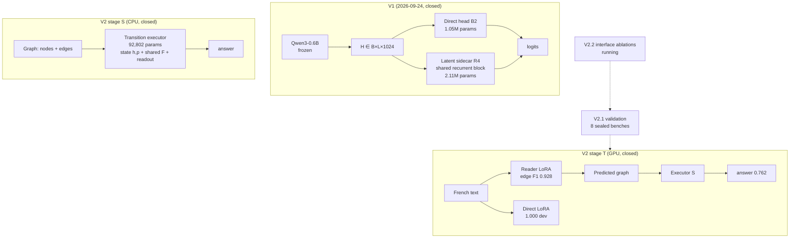

# Decision Coprocessor — Research Compendium

**A two-part empirical study of multi-step decision making with small language backbones: a latent recurrent sidecar (V1, negative result) and a supervised transition executor (V2, mechanism demonstrated; decomposition refuted under fair comparison; interface ablations ongoing).**

> **Status:** private research compendium, snapshot of **2026-09-25**.
> V1 and V2 are closed; V2.1 (frozen-checkpoint validation) is published; V2.2 (interface ablations) is **in progress** at the time of writing.
> All quantitative claims in this repository are traced to versioned reports, hash-pinned configs and archived predictions in the two source repositories.

---

## What this repository is

This compendium explains **everything that was built, measured and concluded** in the *Decision Coprocessor* project:

- the **scientific paper** — LaTeX source and a GitHub-rendered Markdown version ([`paper/`](paper/));
- **detailed technical docs** — architectures, data contracts, experiments, results, methodology, reproducibility ([`docs/`](docs/));
- **figures** — architecture schemas and result plots, generated by a versioned script ([`figures/make_figures.py`](figures/make_figures.py));
- **reference snapshots** of the core model code and frozen configs ([`reference/`](reference/)).

The two working repositories remain the source of truth for raw runs and per-item predictions:

| Repository | Role | State |
|---|---|---|
| `decision-coprocessor/` | V1: frozen-backbone + recurrent sidecar | closed 2026-09-24, negative result published |
| `decision-coprocessor-v2/` | V2 / V2.1 / V2.2: supervised transition executor, text stage, validation, interface ablations | V2 + V2.1 closed; V2.2 running |

---

## The two research questions and their answers

**V1 — Does a small recurrent module appended after a frozen backbone's encoding improve multi-step decisions at acceptable cost (RTX 3070 Laptop, 8 GB)?**

> **No — in that assembly.** Δ(R4−B2) = **−0.59 pt** [−1.25; +0.07] on the reserved depth test; non-recurrent and unshared-stack controls were equal or better; the latent memory was not read; recurrence saturated at k = 1. A post-hoc external audit showed the *targeted mechanism had never been demonstrated before being tested* (the correction head received `q, c_i` directly; final cross-entropy alone imposed no state progression).

**V2 — Is a transition learned, composed and causally useful — before reconnecting language?**

> **Yes in the structured stage (S).** The transition executor (92,802 parameters, CPU) learns the transition, composes zero-shot to depth 10+ never seen in training, follows causal interventions (k-sweep 0.188 → 1.000), and passes a 399/399 stress test.
>
> **No for the usefulness of decomposition on text (T), under a fair comparison.** With an adapted backbone (LoRA) on *both* sides, the direct text→answer path reaches **1.000** dev with a causal profile of 0.996/0.996/0.988, while the text→graph→executor pipeline plateaus at **0.762**: **Δ = −23.8 pts** [−28.3; −19.6] → experience stop.
>
> **But the story does not end there.** V2.1 (frozen checkpoints, new benches) found a **depth reversal**: beyond depth 6 the direct path collapses (0.53 / 0.28 / 0.31 at depths 6/8/10) while the decomposed pipeline degrades gracefully (0.67 / 0.60 / 0.56) — complementarity 123–172 items out of 400. V2.2 located the bottleneck: **the discretisation at the interface**. Propagating successor *distributions* from the frozen fact-level reader (zero training) yields c_prop ≈ **0.85, invariant in depth**, +25.5 pts over discretisation on depth 8 and +57.25 pts over the direct path. A retrained distributional reader (A2) is running as this snapshot is written.

---

## Headline numbers

| | Metric | Value |
|---|---|---|
| V1 | Direct head B2 (1.05 M params), reserved test, macro A/B/C | IID 0.4884 · depth 0.3418 · composition 0.4081 |
| V1 | Sidecar R4 (2.11 M params) | 0.4908 · 0.3359 · 0.4073 · Δdepth = **−0.59 pt** [−1.25; +0.07] |
| V1 | Latency / VRAM (L512, batch 1) | B2 46.18 ms · R4 50.04 ms · 1.199 GiB reserved |
| V2-S | Transition executor, E1–E4 | trajectory 1.000 everywhere; zero-shot depths 6/8/10/16 = 1.000; stress 399/399 |
| V2-T | Adapted reader (LoRA, dev n = 411) | edge F1 **0.9278** · validity 0.917 · solve **0.7616** (4/4 gates, first time) |
| V2-T | Adapted direct vs pipeline | **1.000 vs 0.762** · Δ **−23.84 pts** [−28.33; −19.60] |
| V2.1 | Depth-8 bench (n = 400, frozen) | direct 0.2800 · pipeline 0.5975 · propagation 0.8525 |
| V2.2 | A1-bis propagation, zero training | c_prop **0.83–0.86 invariant in depth**; Δ vs discretisation IC > 0 on 8/8 benches |
| total | registered compute | V2: ≈ **4.96 h** GPU; full project ≤ **6 h** of GPU time, ⟨ 2.1 GiB VRAM peak |

---

## Reading guide

1. **[`paper/PAPER.md`](paper/PAPER.md)** — the full paper (renders directly on GitHub, figures included). LaTeX version: [`paper/main.tex`](paper/main.tex).
2. **[`docs/00-overview.md`](docs/00-overview.md)** — 10-minute overview of the whole project.
3. **[`docs/12-timeline.md`](docs/12-timeline.md)** — what happened, when, with which evidence.
4. **[`docs/09-methodology.md`](docs/09-methodology.md)** — pre-registration, independent QA, sealed test sets, fairness rules.
5. **[`docs/10-results-reference.md`](docs/10-results-reference.md)** — every published number with its source report.
6. **[`docs/11-reproducibility.md`](docs/11-reproducibility.md)** — where the code/configs/hashes live.

---

## Project at a glance



Detailed Mermaid diagrams for each architecture live in [`docs/`](docs/) and as hand-written SVGs in [`paper/figures/`](paper/figures/).

---

## Reproducing the figures and building the paper

```bash
# Figures (SVG + PDF) — requires uv; downloads matplotlib into an ephemeral env
make figures

# Markdown paper renders on GitHub (includes the generated SVGs)

# LaTeX paper (needs a TeX distribution, e.g. TeX Live)
make paper        # → paper/main.pdf
```

---

## Citation

```bibtex
@misc{decision_coprocessor_2026,
  title  = {Decision Coprocessor: a two-stage empirical study of multi-step decision making with small frozen backbones},
  author = {C. Garrot and the agent mesh (@ag-1..@ag-5)},
  year   = {2026},
  month  = {9},
  note   = {Research compendium, snapshot 2026-09-25; V1 closed, V2/V2.1 closed, V2.2 in progress}
}
```

See [`CITATION.cff`](CITATION.cff).

---

## License

Documentation and paper: **CC BY 4.0**. Reference code snapshots: **MIT** (see [`LICENSE`](LICENSE)).
