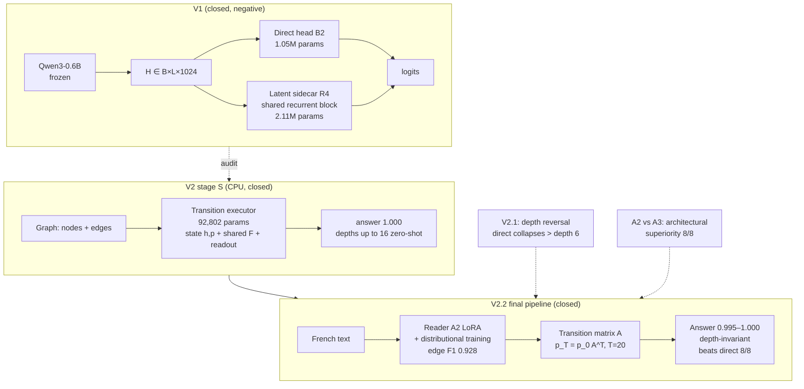

# Decision Coprocessor — Research Compendium

**A two-part empirical study of multi-step decision making with small language backbones: a latent recurrent sidecar (V1, negative result) and a supervised transition executor (V2, mechanism demonstrated; decomposition initially refuted under fair comparison, then fixed and re-validated; interface ablations closed).**

> **Status:** private research compendium, final snapshot of **2026-09-26**.
> **All programs are closed** — V1, V2, V2.1, V2.2 (A1, A1-bis, A2, A3, router bound, costs) and the **confirmation programme C0/C1/C2** (third-audit errata, same-reader attribution, three-seed confirmation, blind extrapolation) — every gate and every QA reserve closed (REG-86).
> All quantitative claims in this repository are traced to versioned reports, hash-pinned configs and archived predictions in the two source repositories.

---

## What this repository is

This compendium explains **everything that was built, measured and concluded** in the *Decision Coprocessor* project:

- the **scientific paper** — LaTeX source and a GitHub-rendered Markdown version ([`paper/`](paper/));
- **detailed technical docs** — architectures, data contracts, experiments, results, methodology, reproducibility ([`docs/`](docs/));
- **figures** — architecture schemas and result plots, generated by a versioned script ([`figures/make_figures.py`](figures/make_figures.py));
- **reference snapshots** of the core model code, frozen configs and key reports ([`reference/`](reference/)).

The two working repositories remain the source of truth for raw runs and per-item predictions:

| Repository | Role | State |
|---|---|---|
| `decision-coprocessor/` | V1: frozen-backbone + recurrent sidecar | closed, negative result published |
| `decision-coprocessor-v2/` | V2 / V2.1 / V2.2 / confirmation C0-C1-C2 | **all closed** (85 commits) |

---

## The research questions and their final answers

**V1 — Does a small recurrent module appended after a frozen backbone's encoding improve multi-step decisions at acceptable cost (RTX 3070 Laptop, 8 GB)?**

> **No — in that assembly.** Δ(R4−B2) = **−0.59 pt** [−1.25; +0.07] on the reserved depth test; non-recurrent and unshared-stack controls were equal or better; the latent memory was not read; recurrence saturated at k = 1. A post-hoc external audit showed the *targeted mechanism had never been demonstrated before being tested* (the correction head received `q, c_i` directly; final cross-entropy alone imposed no state progression).

**V2 — Is a transition learned, composed and causally useful — before reconnecting language?**

> **Yes in the structured stage (S).** The transition executor (92,802 parameters, CPU) learns the transition, composes zero-shot to depth 16 never seen in training, follows causal interventions (k-sweep 0.188 → 1.000), and passes a 399/399 stress test.
>
> **Initially no for text (T), under a fair comparison.** With an adapted backbone (LoRA) on *both* sides, the direct text→answer path reached **1.000** dev (causal profile 0.996/0.996/0.988) while the text→graph→executor pipeline plateaued at **0.762**: Δ = **−23.8 pts**.
>
> **Then the picture inverted and the deficit was fixed.** V2.1 (frozen checkpoints, new benches) found a **depth reversal**: beyond depth 6 the direct path collapses (0.28 at depth 8) while the pipeline holds (0.60). V2.2 located and repaired the bottleneck: **discretisation at the interface**. Propagating successor *distributions* from the frozen fact-level reader (zero training) yields c_prop ≈ 0.85 invariant in depth (+25.5 pts at depth 8, +57 pts vs direct). With distributional training (A2), the pipeline reaches **0.995–1.000** on all eight held-out benches, beating the direct path with CIs excluding zero on 8/8 (up to **+71.75 pts** at depth 8) and matching the deterministic template parser (1.000/1.000 — the earlier “0.95 ceiling” was a framing error). An equal-supervision direct control (A3) stays collapsed in depth (0.25–0.28): **the gain is architectural**. A third audit then drove the **confirmation programme**: same-reader attribution (both uncertainty conservation and better local reading contribute), **three-seed confirmation** (Δ +65.83 pts mean, dispersion ≤0.33 pt) and a **blind extrapolation** (0.9867 pooled deep with training *and selection* restricted to short chains, vs 0.271 for the control). The router oracle bound is +0.00 to +0.50 pts → no router built for accuracy.

---

## Headline numbers

| | Metric | Value |
|---|---|---|
| V1 | Direct head B2 (1.05 M params), reserved test, macro A/B/C | IID 0.4884 · depth 0.3418 · composition 0.4081 |
| V1 | Sidecar R4 (2.11 M params) | 0.4908 · 0.3359 · 0.4073 · Δdepth = **−0.59 pt** [−1.25; +0.07] |
| V1 | Latency / VRAM (L512, batch 1) | B2 46.18 ms · R4 50.04 ms · 1.199 GiB reserved |
| V2-S | Transition executor, E1–E4 | trajectory 1.000 everywhere; zero-shot depths 6/8/10/16 = 1.000; stress 399/399 |
| V2-T | Adapted reader (LoRA, dev n = 411) | edge F1 **0.9278** · validity 0.917 · solve **0.7616** (4/4 gates, first time) |
| V2-T | Adapted direct vs pipeline (short chains) | **1.000 vs 0.762** · Δ **−23.84 pts** [−28.33; −19.60] → experience stop |
| V2.1 | Depth-8 bench (n = 400, frozen) | direct 0.2800 · pipeline 0.5975 · propagation 0.8525 |
| V2.2 | A1-bis propagation, zero training | c_prop **0.83–0.86 invariant in depth**; Δ vs discretisation IC > 0 on 8/8 |
| **V2.2** | **A2 propagation, distributionally trained** | **c_prop 0.995–1.000 on 8/8 held-out benches**; Δ vs direct **+5.75 (short) … +71.75 (depth 8)**, IC > 0 8/8; NLL 0.0044–0.0294 |
| **V2.2** | **A3 equal-supervision direct control** | depth 0.2475–0.2825 → **Δ(A2−A3) +3.25 … +75.0 pts, IC low > 0 8/8** → architectural superiority |
| **C1** | **Same-reader 2×2 (R0/R1 × hard/soft)** | both factors contribute; soft > hard at fixed reader (+14…+22 pts); complete Brier R1 0.0016–0.0119 vs R0 0.30–0.58; anti-leak 3 layers PASS |
| **C2-a** | **3-seed confirmation (fresh benches/seeds)** | Δ(A2−A3) pooled deep **+65.83 pts mean** (s17 +65.30 · s18 +64.05 · s19 +68.14, CI low > 0), **dispersion ≤0.33 pt** |
| **C2-b** | **Blind extrapolation (short-only selection)** | A2-blind pooled deep **0.9867** vs control **0.2710**; criterion ≥0.90 → largely successful |
| **V2.2** | **Router oracle bound** | **+0.00 to +0.50 pts** over A2 → no router built for accuracy |
| **V2.2** | **Costs (batch 8)** | A2 ×1.23–1.27 vs A3 latency; **propagation 0.59–0.66 ms ≈ 1.3–1.5 % (low in this profile)**; VRAM parity |
| **Parser** | Deterministic parser + exact solver (bounded to templates) | **1.0000 on 8/8 benches (3200/3200)** — the upper bound of any system on this synthetic domain |
| total | registered compute | V2 ≈ **4.96 h** GPU + V2.2 runs (A2 ≈ 68 min, A3, costs) + **C2 night ≈ 7 h**; VRAM peak ≈ 2.1 GiB |

---

## Reading guide

1. **[`paper/PAPER.md`](paper/PAPER.md)** — the full paper (renders directly on GitHub, figures included). LaTeX version: [`paper/main.tex`](paper/main.tex).
2. **[`docs/00-overview.md`](docs/00-overview.md)** — 10-minute overview of the whole project.
3. **[`docs/12-timeline.md`](docs/12-timeline.md)** — what happened, when, with which evidence.
4. **[`docs/07-v22-interface-ablations.md`](docs/07-v22-interface-ablations.md)** — the final resolution: A1 → A2 → A3 → router → costs → audit #3 → C1 attribution → C2 confirmation.
5. **[`docs/09-methodology.md`](docs/09-methodology.md)** — pre-registration, independent QA, sealed test sets, fairness rules.
6. **[`docs/10-results-reference.md`](docs/10-results-reference.md)** — every published number with its source report.
7. **[`docs/11-reproducibility.md`](docs/11-reproducibility.md)** — where the code/configs/hashes live.

---

## Project at a glance



Detailed Mermaid diagrams for each architecture live in [`docs/`](docs/) and as generated figures in [`paper/figures/`](paper/figures/).

---

## Reproducing the figures and building the paper

```bash
# Figures (SVG + PDF) — requires uv; downloads matplotlib into an ephemeral env
make figures

# Markdown paper renders on GitHub (includes the generated SVGs)

# LaTeX paper (needs a TeX distribution, e.g. TeX Live)
make paper        # → paper/main.pdf
```

---

## Citation

```bibtex
@misc{decision_coprocessor_2026,
  title  = {Decision Coprocessor: From a Latent Recurrent Sidecar to a Supervised Transition Executor},
  author = {C. Garrot and the agent mesh (@ag-1..@ag-5)},
  year   = {2026},
  month  = {9},
  note   = {Research compendium, final snapshot 2026-09-25; V1/V2/V2.1/V2.2 all closed}
}
```

See [`CITATION.cff`](CITATION.cff).

---

## License

Documentation and paper: **CC BY 4.0**. Reference code snapshots: **MIT** (see [`LICENSE`](LICENSE)).
