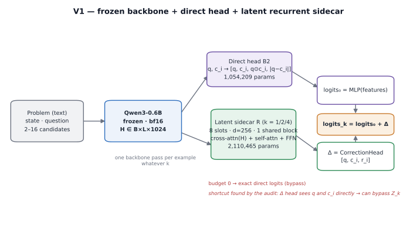
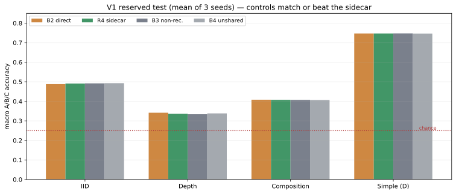
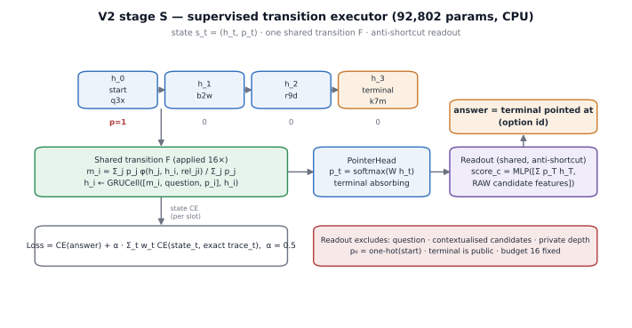
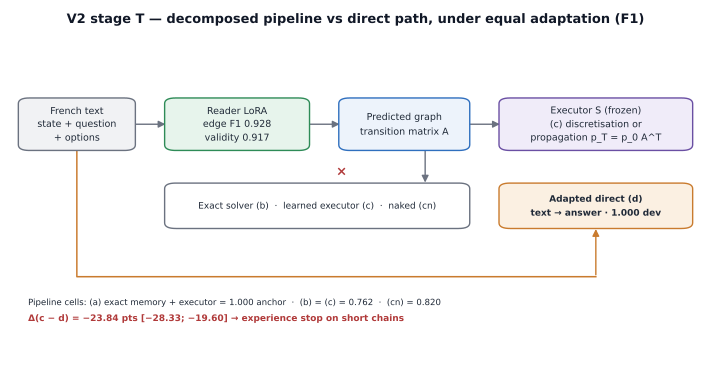
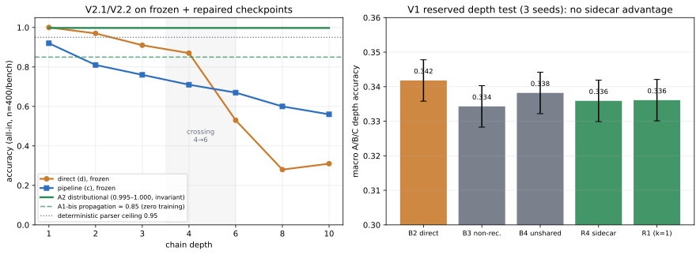
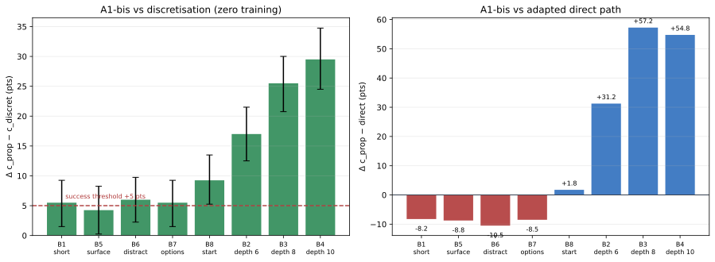

# Decision Coprocessor: From a Latent Recurrent Sidecar to a Supervised Transition Executor — or When Explicit Decomposition Loses to a Fairly Adapted Direct Path

**C. Garrot** and the agent mesh (@ag-1…@ag-5)

*Research compendium — snapshot 2026-09-25. V1 and V2 closed; V2.1 published; V2.2 in progress.*

---

## Abstract

Can a small, explicitly computational module improve multi-step decisions made by a small language model without generating intermediate text, on a single 8 GB consumer GPU? We report a two-part empirical study. **V1** attached a latent recurrent *sidecar* (2.11 M parameters) to a frozen Qwen3-0.6B backbone and evaluated it on 53,500 oracle-generated problems with a reserved test opened once after pre-registration. The sidecar did not improve depth decisions: Δ(R4−B2) = −0.59 pt [−1.25; +0.07]; non-recurrent and unshared-stack controls matched it; recurrence saturated at k = 1; a diagnostic showed the latent memory was barely read. An external audit established that the targeted mechanism had never been demonstrated in that assembly — the correction head had direct access to the query and candidate representations, and a final cross-entropy imposed no state progression. **V2** rebuilt the idea from first principles as a *supervised transition executor* on an explicit graph state (92,802 parameters, CPU stage): one shared transition, exact state traces as supervision, and an anti-shortcut readout. Stage S established a learned, composed, causally verified transition: trajectory accuracy 1.000 on all gates, zero-shot depths 6/8/10/16 at 1.000, 399/399 under a 20-node stress, and a causal k-sweep rising from 0.188 to 1.000. Stage T reconnected language with a LoRA-adapted reader. Under a fairness rule requiring identical adaptation for both paths, the direct text→answer path reached 1.000 dev (causal profile 0.996/0.996/0.988) while the text→graph→executor pipeline plateaued at 0.762 — Δ = −23.84 pts [−28.33; −19.60] — an experience stop for decomposition *on that protocol*. A post-closure validation on eight fresh frozen-checkpoint benches then found a **depth reversal**: the direct path collapses beyond depth 6 (0.28 at depth 8) while the pipeline holds (0.60), with 123–172/400 complementary items. Pre-registered interface ablations localised the pipeline's bottleneck to **discretisation**: propagating successor *distributions* from the frozen reader, at zero training cost, restores a depth-invariant accuracy of 0.83–0.86 (depth 1→10), +25.5 pts over discretisation at depth 8 and +57.25 pts over the direct path, with confidence intervals excluding zero on all eight benches. A distributionally retrained reader is running as this snapshot is written. We document the entire evidence chain — pre-registration, independent QA recomputation, sealed sets, incidents and reserves — and distil thirteen transferable lessons.

**Keywords:** multi-step reasoning, latent computation, transition executor, frozen backbones, LoRA, pre-registration, negative results, small-scale evaluation.

---

## 1. Introduction

Reasoning with small language models on modest hardware invites a specific temptation: making a *small* amount of extra computation look like *deliberation*. A recurrent module appended to a frozen encoder is cheap, elegant, and easy to believe in. Our project began with that hypothesis and ended up producing something more interesting than a confirmation.

The study has two research questions, asked thirteen months apart in project time (24–25 September 2026):

- **V1:** Does a small recurrent module appended after the encoding of a frozen backbone improve decisions requiring several dependent operations, at an acceptable real cost on a RTX 3070 Laptop (8 GB)?
- **V2:** Is a transition **learned**, **composed**, and **causally useful** — *before* reconnecting language?

V1 answered its question with a documented negative. A critical external audit then showed that the negative did not test the intended mechanism: the correction head received the query `q` and the contextualised candidate `c_i` directly, so the network could answer without executing any latent composition, and a single final cross-entropy imposed no state progression, which explains the observed saturation at k = 1. V2 rebuilt the mechanism in its purest form — a **transition executor** on an explicit graph, supervised by exact intermediate states, with an explicit anti-shortcut readout — first on structured input (stage S, CPU only), then on text (stage T).

The results form a chain in which every claim is scoped and falsifiable:

1. **S demonstrated (V2).** The transition is learned, composed zero-shot to unseen depths, causally useful, and robust.
2. **T refuted under fairness (V2).** With identical LoRA adaptation for both paths, the decomposed pipeline is clearly dominated by the direct path on short chains: −23.8 pts.
3. **The refutation is depth-scoped (V2.1).** On fresh frozen-checkpoint benches, the direct path collapses beyond depth 6 while the pipeline degrades gracefully: +14 to +32 pts for the pipeline at depths 6/8/10.
4. **The remaining gap is the interface (V2.2).** Propagating successor distributions instead of per-edge argmax, with zero training, removes the depth decay entirely (0.83–0.86 invariant), beating the direct path by up to +57 pts in depth — while still leaving ≈ 9–12 pts to the deterministic ceiling.

The methodological spine of the project is stated in Section 3 and bears repeating: pre-registration with hashed configs, an independent QA agent that recomputes every metric from archived per-item predictions, sealed evaluation sets, causal interventions as the only admissible mechanistic evidence, and a registered **fairness rule** (identical representation budgets for pipeline and control) that overturned a conclusion when applied.

### Contributions

- A complete, reproducible **negative result** on latent recurrent coprocessors over a frozen backbone, with controls at matched parameter and inference budgets and a mechanistic diagnosis of why the assembly could not work (§4).
- A **supervised transition executor** that demonstrates learned, composed, causal, depth-generalising execution on a controlled relational task with 92,802 parameters on CPU (§5).
- A **fairness study** showing that the apparent benefit of text decomposition (+5.1 pts, inconclusive) becomes a decisive deficit (−23.8 pts) once the direct path receives the same adaptation — and that this deficit is depth-scoped (§6–§7).
- A **zero-training interface repair**: propagating distributions rather than argmax restores depth invariance of a frozen reader, with CIs excluding zero on 8/8 benches (§8).
- A **methodology** (pre-registration, seals, paired causal interventions, mechanism-before-benefit precedence, incident invariants) with measurable effects on the conclusions (§3, §9).

---

## 2. Related work and positioning

Our starting point was the family of **latent-computation** approaches: Perceiver-style cross-attention to a small latent space [S06]; differentiable cache augmentation of a frozen LLM [S07]; soft chain-of-thought through a fixed assistant and projection [S08]; continuous latent reasoning [S09]; recurrent refinement of proposed latents for frozen LLMs [S10]; and continuous latent test-time scaling in other modalities [S11]. Our V1 sidecar is architecturally close to this family (cross-attention plus self-attention over learned slots, residual correction), and V1's negative result is, in our reading, explained by the *supervision and shortcut structure* rather than by the family.

The control of computation over depth relates to **PonderNet** [S12] and to tiny recursive networks on structured tasks [S13]; we adopted a fixed budget with an absorbing terminal instead of a learned halting policy, and deferred gating entirely (as recommended by our audit) until mechanism utility was demonstrated.

Procedural supervision resembles **process supervision / distillation** [S14] in spirit: we supervise exact intermediate states produced by an oracle, but unlike distillation we do not generate natural-language rationales at any point.

Our tasks are synthetic and oracle-generated; the closest public benchmark is **ProofWriter** [S16], which we deliberately did not run — our goal was controlled difficulty axes (depth, distractors, composition) rather than natural-language transfer. Calibration methodology follows [S15], and we publish NLL, Brier and ECE jointly because of the well-known single-metric pitfalls.

**Positioning.** We claim no new architecture. Our contribution is an unusually complete evidence chain for a small-scale question, and in particular two findings that we did not expect: (i) the fairness of representation budgets can invert an architectural conclusion, and (ii) a frozen reader's depth decay can be an artefact of *discretisation at the interface* rather than of information loss — repairable without retraining.

---

## 3. Method

### 3.1 Verdict frames

Every claim is published at one of three levels: **experience stop** (stopping investment in a configuration on clearly unfavourable results), **local scientific conclusion** (valid for the measured domain and protocol), and **product validation** — which is never claimed. Hypotheses, stop rules and thresholds were written and hashed before runs.

### 3.2 Data

All data is programmatically generated with exact oracles; every example has a public view (what the model sees) and a private view (answer, trace, depth, group id). Grouping is assigned before variations, and variants never cross splits. V1 generated 53,500 examples across four families (Horn-rule deduction with established/refuted/undetermined semantics; relational chains; bounded programs with distractors; simple controls), with train/dev/router/calibration and three reserved test sets (IID, depth 6/8/10, composition). V2's structured family is a simplified relational task: disjoint chains, unique successor, ≥ 3 terminals, unreachable distractors, opaque renamed entities, shuffled facts. V2's text view is a deterministic French rendering with eight edge formulations, six terminal formulations, five question forms and seven option wrappers, validated against a trivial lexical probe. Full contracts are in Appendix A and in the companion documentation.

### 3.3 Evaluation discipline

- **Pre-registration:** protocol document, hashed config, registry entry before start; scripts committed before use; nothing tuned after seeing results.
- **Independent QA:** a separate agent re-implements oracles and recomputes metrics from archived per-item predictions (including raw logits where needed). QA findings blocked or reshaped several experiments.
- **Seals:** V1's reserved test was opened once; `E5_eval` (defective bench) and `E5v2_eval` were sealed forever with zero artefacts; V2.1 benches are evaluation-only; seed 2213 is selection-only for V2.2.
- **Statistics:** paired comparisons by group id with coupled grouped bootstrap (2000), 95 % CIs; one primary comparison per study; everything else labelled exploratory; all denominators published.
- **Mechanism:** four mandatory measures — full-trajectory accuracy, transition accuracy conditional on a correct state, autonomous roll-out at unseen depths, and paired causal interventions. Probes alone never suffice.

### 3.4 Fairness rules

**F1 (representation fairness).** Any advantage — layers, adaptation, context — must be given identically to the decomposed path and the direct control before comparing. **F2** adaptation invalidates any cached hidden state. **F3** no selection on evaluation data. **F4** abstention rules pre-registered and symmetric; primary metric all-in, coverage/risk published separately.

---

## 4. V1: frozen backbone + latent recurrent sidecar

### 4.1 Model

A frozen `Qwen/Qwen3-0.6B` (596 M parameters, revision pinned) encodes the serialised problem once per example: `H ∈ B×L×1024`. A shared direct head scores each candidate from `q` (last valid token) and `c_i` (masked mean of candidate tokens) with features `[q, c_i, q⊙c_i, |q−c_i|]` (1,054,209 parameters; baseline **B2**). A latent sidecar (2,110,465 trainable parameters) keeps 8 slots of width 256, projects `H` into keys/values once, and applies one **shared** block (cross-attention to memory, self-attention, FFN; residual scale 0.1) k times, then a residual correction `Δ_i = CorrectionHead([q, c_i, r_i])` where `r_i` attends over the final slots. Budget 0 returns the direct logits exactly.

Controls: **B3** non-recurrent with a single widened pass (same parameter budget); **B4** four unshared blocks (comparable cost); **B1** frozen features; **B0** label priors; **G4** a gate over {0,4} steps.



### 4.2 Protocol

Training in phases: A (B2 ×3 seeds), B (sidecar ×3 seeds initialised from the matching B2 checkpoint, direct head frozen), C (controls ×3 seeds). AdamW, lr 3e-4, effective batch 32, 1,200-step cap (≈1.28 epoch actually used), bf16 backbone with FP32 trainable modules. Selection on dev; reserved test opened once after pre-registration v2.1; exclusions >512 tokens frozen id-by-id; a first latency pass invalidated (laptop clocks) and rerun warm.

### 4.3 Results

The reserved test (macro A/B/C over three seeds) is summarised below; the direct head learns clearly (IID 0.4884), but the sidecar does not improve depth decisions and the controls are equal or better.

| Variant | Params | IID | Depth | Composition | Δ depth vs B2 [CI95] |
|---|---:|---:|---:|---:|---|
| **B2** direct | 1,054,209 | 0.4884 | **0.3418** | 0.4081 | — |
| B3 non-recurrent | 2,178,177 | 0.4918 | 0.3343 | 0.4070 | **−0.75 [−1.40; −0.08]** |
| B4 unshared ×4 | 5,270,785 | 0.4930 | 0.3382 | 0.4062 | −0.36 [−1.02; +0.32] |
| R4 sidecar | 2,110,465 | 0.4908 | 0.3359 | 0.4073 | **−0.59 [−1.25; +0.07]** |
| R4 − R1 | same | — | — | — | −0.02 (saturation k=1) |
| G4 gate | 35,116 | 0.4934 | 0.3420 | 0.4070 | −0.62 ns; activation 47.9–56.7 % |
| B0 majority | 0 | 0.2785 | 0.3334 | 0.2830 | — |
| B1 frozen | 0 | 0.2741 | 0.2827 | 0.2715 | — |



Further facts: R4 produced 181 corrections against 238 degradations on depth; NLL was marginally worse than B2 (+0.003); latency was 46.18 ms (B2) vs 50.04 ms (R4) at L512 batch 1; VRAM peak 1.199 GiB. The depth test lost 920/4,000 examples to the 512-token limit (81 % of family-B depth-10), so depth conclusions are conditional on that population.

### 4.4 Diagnosis and the audit

Diagnostics showed (i) masking or shuffling the memory changed nothing (0 flips/500; Δlogits ≤ 0.004); (ii) steps 2–4 amplified a frozen correction; (iii) information was readable through candidate representations, not the latent state; (iv) per-instance predictions were unstable under option permutation (~39 %), a defect shared with the direct head. The external audit added the decisive point: the mechanism could be bypassed (`q, c_i` in the correction) and was never forced to progress (final CE only). **V1 tested an assembly that could avoid reasoning; it did not refute the coprocessor idea.**

---

## 5. V2 stage S: supervised transition executor

### 5.1 Design

Stage S removes language entirely. A problem is a graph: nodes, directed edges, a start node, candidates. The model maintains a state `s_t = (h_t, p_t)` — per-entity vectors and a pointer distribution. Each step:

```text
m_i(t) = Σ_j p_j · φ(h_j, h_i, rel_ji) / Σ_j p_j        (messages emitted by the pointer wavefront)
h_i(t+1) = GRUCell([m_i, question, p_i], h_i)           (one SHARED transition F)
p_t = softmax(pointer_head(h_t))                        (active pointer; terminal absorbing once reached)
```

The final readout scores candidates from the state summary and **raw** candidate features only; the question and contextualised candidates are excluded — this is the explicit anti-shortcut correction of the V1 defect. The loss is:

$$\mathcal{L} = \mathrm{CE}(\text{answer}) + \alpha \sum_t w_t \, \mathrm{CE}(\text{state}_t, \text{state}^\star_t), \qquad \alpha = 0.5,$$

with exact oracle trace targets and weights summing to one, the absorbing terminal's mass spread evenly. Budget is fixed at 16 steps; `p_0` is the one-hot start (a task constraint, never a free summary). Total: 92,802 parameters, pure CPU.



### 5.2 Gates

| Gate | Setting | Result |
|---|---|---|
| **E1** overfit 128 short problems | autonomous roll-out | **1.000** trajectory (128/128), final 1.000; 452 s CPU |
| **E2** zero-shot on 335 unseen graphs | exact input states, depths 1–4 (d4 unseen) | **919/919 = 1.000**; base 767/767, decisive pairs 152/152 |
| **E3** depths 2/3/4, 13–16 nodes | autonomous, conditional, k-sweep, direct control | trajectory **1.000** (255/255); conditional **1.000**; vs direct **1.000 vs 0.204**, 203 corrections / 0 degradations |
| **E4/E4b** depths 6/8/10/16, 20-node stress | zero-shot from E3_train only | **399/399 = 1.000**; 0 state divergences; stress 30/30 |

Two E0 defects had to be fixed first: the pointer was not reinjected (≈2-hop ceiling) and terminals were frozen at initialisation (unreachable ends). Both were caught by a diagnostic overfit plateau. E3 needed a second attempt: lr 3e-3 collapsed on the full pool (trajectory 0.000) while single-problem, subset and full-pool-at-1e-3 diagnostics all reached 100 % — an optimisation failure, not an expressivity one.

### 5.3 Causal evidence

The k-sweep applies one trained model at different step counts:

| k | 0 | 1 | 2 | 4 | 8 | 16 |
|---|---:|---:|---:|---:|---:|---:|
| E3 final answer | 0.188 | 0.271 | 0.522 | **1.000** | 1.000 | 1.000 |
| E4b final answer | 0.286 | — | — | — | — | **1.000** (0.960 at k=10) |

States advance one hop per iteration and are correct at every k; the answer only becomes readable once the terminal is reached. Iterations are causally necessary and sufficient. State divergence after a correct prefix: zero on 399/399.

**Conclusion (S).** A transition can be learned, composed zero-shot beyond its training depths, and causally verified on this task, with a 93 K-parameter CPU model. This is a statement about the mechanism, not about language.

---

## 6. V2 stage T: reconnecting language

### 6.1 Reader and pipeline

A reader maps French text to the structured memory: a BIO-style mention tagger, fact-level subject/object heads (relations read per visible line), a question-conditioned start head plus a deterministic containment fallback (the question always cites the start), and terminals derived from END facts. The pipeline is reader → exact solver or learned executor; the direct path is an equal-rights text→answer classifier. Cells: (a) exact memory + executor (anchor), (b) predicted memory + exact solver, (c) predicted memory + executor (the pipeline under test), (cn) naked variant, (d) direct.



### 6.2 Benchmark validation saved the study twice

E5 v1 looked valid but a trivial lexical probe plus causal interventions exposed a template shortcut: the direct path scored 0.7775 by exploiting a distributional template lever. The bench was archived as defective, its sealed eval remained closed forever, and E5v2 was rebuilt with shuffled template decks, per-option wrappers, recall formulations, and a distractor-length post-pass. On E5v2 the lexical probe is at chance (0.218–0.243 vs 0.221) and the direct path drops to 0.326 — the previous “strong baseline” was a mirage.

Frozen-reader iterations (bounded to three, one variable at a time) improved edges from 0.397 to 0.725 and fixed the start with a deterministic rule, but plateaus at solve 0.248 (three misses). A controlled-noise experiment then showed that the apparent executor advantage over the exact solver was an abstention-policy artefact, not robustness. The verdict was a documented local failure (iii) with the benefit published as a grey zone.

### 6.3 Representation fairness inverts the conclusion

The final experiment of V2 gave **both** paths the same LoRA adaptation (r16/α32 on q/k/v/o, dropout 0.05, two learning rates, 1200 steps, seed 17, caches invalidated).

| Cell | Accuracy (dev n = 411) | Causal profile (decisive / distractor / permutation) |
|---|---:|---|
| (a) exact → executor | 1.000 | 1.000 / 1.000 / 1.000 |
| (b) solver | 0.7616 (abst. 0.083) | 0.780 / 0.588 / 0.932 |
| (c) pipeline | 0.7616 | 0.780 / 0.588 / 0.932 |
| (cn) naked | 0.8200 | 0.840 / 0.632 / 1.000 |
| **(d) direct adapted** | **1.0000** | **0.996 / 0.996 / 0.988** |

Reader gates were all passed for the first time (entities 1.000, edges 0.9278, start 1.000, solve 0.7616; validity 0.917), validating the pre-registered hypothesis that adaptation — not head architecture — was the extraction bottleneck. But the same adaptation lifts the direct path to 1.000: **Δ(c−d) = −23.84 pts [−28.33; −19.60] → issue (iii)**. The pipeline cannot beat a direct path that composes causally (0.996 decisive-fact following) on short chains; decomposition adds a fallible step with no residual benefit *in this regime*.

The contrast with the frozen regime is the central scientific result:

| Regime | Pipeline (c) | Direct (d) | Δ(c−d) | Reading |
|---|---:|---:|---:|---|
| Frozen backbone | 0.338 | 0.287 | +5.1 [−1.7; +11.7] | grey zone — but the baseline was crippled |
| Adapted (fair) | 0.762 | **1.000** | **−23.84 [−28.33; −19.60]** | decomposition dominated |

---

## 7. V2.1: frozen-checkpoint validation and the depth reversal

### 7.1 Protocol

No retraining; frozen artefacts (executor S, reader LoRA, direct LoRA); eight fresh benches of 400 items each (seeds 2205–2212): short depth 1–4, depth 6/8/10, surface paraphrases, extra distractors, permuted options, changed start; K ∈ {4,5,6}, ≤20 nodes, French; strict signature disjunction from all previous pools; thresholds frozen before any prediction. Oracle diagnostics (path corrector, exact graph) were published in separate tables and never counted as scores.

### 7.2 Results

| Bench | (a) anchor | (c) pipeline | (d) direct | Δ(c−d) [CI95] |
|---|---:|---:|---:|---|
| B1 short (1–4) | 1.000 | 0.800 | 0.9375 | −13.75 [−18.2; −9.2] |
| B5 surface | 1.000 | 0.810 | 0.940 | −13.00 |
| B6 distractors | 1.000 | 0.772 | 0.9375 | −16.50 |
| B7 options | 1.000 | 0.800 | 0.940 | −14.00 |
| B8 other start | 1.000 | 0.765 | 0.840 | −7.50 |
| **B2 depth 6** | 1.000 | 0.667 | 0.525 | **+14.25 [+7.5; +21.0]** |
| **B3 depth 8** | 1.000 | 0.598 | 0.280 | **+31.75 [+25.0; +38.5]** |
| **B4 depth 10** | 1.000 | 0.560 | 0.3075 | **+25.25 [+18.3; +32.0]** |



The accuracy-vs-depth curves cross between depth 4 and 6: direct 1.00/0.97/0.91/0.87 then 0.53/0.28/0.31 (depths 1/2/3/4/6/8/10); pipeline 0.92/0.81/0.76/0.71 then 0.67/0.60/0.56.

### 7.3 Localisation

- **(a) = 1.000 everywhere, including depth 10:** the executor composes; the deficit is entirely in reading.
- **Path-only oracle corrector:** 0.950/0.965/0.9825/0.9825 (B1→B4) vs baseline 0.800/0.667/0.598/0.560. Fixing **only the useful-path edges** recovers almost everything; fixing the start or off-path edges changes nothing.
- **Complementarity:** 123/172/163 of 400 items (depths 6/8/10) where the pipeline is right and the direct path wrong; the direct path's NLL grows 0.59 → 8.85 nats with depth (it “knows” it is lost), giving a routing signal to exploit after measuring the oracle router bound.
- **Deterministic parser control:** coverage 1.0000, agreement 1.0000 on 3,200/3,200 items bounded to the templates — the information **is** in the public text; the deficit is in learned extraction and, crucially, in the interface.
- **Environment caveat:** CPU vs GPU can differ by ≈ 6 pts on this near-tie reader; published numbers are labelled with their measurement environment, and a stable `eps` tie-break was introduced for later runs.

---

## 8. V2.2: interface ablations (ongoing)

**Hypothesis (pre-registered):** the depth deficit comes from discretisation at the interface — per-edge argmax kills a chain on a single missing edge — not from the reader's information (edge F1 0.93; parser ceiling 0.95). Propagating distributions `p_{t+1} = p_t A` should recover a measurable part of the gap.

### 8.1 A1: failure with a real cause

A1 propagated distributions from the frozen reader using the **bilinear** successor head — which is never supervised in fact mode (top-1 0.054 ≈ chance). It propagated noise: c_prop 0.19–0.32 vs discretisation 0.56–0.81 → Δ = −38.25 pts. The failure is documented; the initial “mass-leak” explanation was withdrawn. (An archive contamination during QA recovery was detected, resolved by guards, and the aggregate regenerated bit-identically on GPU.)

### 8.2 A1-bis: zero-training repair (PASS)

A1-bis builds the transition matrix from the **supervised fact-level** heads:

$$A[u,v] = \sum_f P(\text{subject}_f = u)\, P(\text{object}_f = v),$$

with a self-loop for terminals, an absorbing UNKNOWN sink for missing subject mass, no silent renormalisation, and a stable tie-break. **No training, no optimiser, frozen checkpoints, sealed benches.**

| Bench | c_prop | c_discret | Δ [CI95] | Δ vs direct |
|---|---:|---:|---|---:|
| B1 short | 0.8550 | 0.8000 | **+5.50** [+1.50; +9.25] | −8.25 |
| B2 depth 6 | 0.8375 | 0.6675 | **+17.00** [+12.50; +21.50] | +31.25 |
| **B3 depth 8** | 0.8525 | 0.5975 | **+25.50** [+20.75; +30.00] | **+57.25** |
| B4 depth 10 | 0.8550 | 0.5600 | **+29.50** [+24.50; +34.75] | +54.75 |
| B5 surface | 0.8525 | 0.8100 | **+4.25** [+0.25; +8.25] | −8.75 |
| B6 distractors | 0.8325 | 0.7725 | **+6.00** [+2.25; +9.75] | −10.50 |
| B7 options | 0.8550 | 0.8000 | **+5.50** [+1.50; +9.25] | −8.50 |
| B8 other start | 0.8575 | 0.7650 | **+9.25** [+5.25; +13.50] | +1.75 |



**c_prop ≈ 0.83–0.86, invariant from depth 1 to depth 10**, versus the discretisation decay 0.80 → 0.56. All eight CIs exclude zero; the main criterion (B3 ≥ +5 pts) is cleared fivefold; short-chain non-regression holds. Remaining gap to the 0.95 template-parser ceiling: ≈ 9–12 pts.

### 8.3 A2 (running at snapshot)

A2 retrains the reader with **distributional** supervision: transitions trained as distributions, propagation `p_{t+1} = p_t A` inside the graph so the answer CE back-propagates to edge distributions, states supervised per step, and an explicit **UNKNOWN** class defined as “no information” (distinct from terminal; absorbing sink). It initialises from the frozen best reader, reuses the identical LoRA recipe, and selects checkpoints on a fresh bench (seed 2213, selection only). A training-only augmentation (25 % items with one fact removed, answer/state losses masked) exposes the UNKNOWN semantics; evaluation benches are unaugmented.

Run 1 was cancelled (gradient checkpointing inactive → OOM; a gold/predicted mismatch corrupted the selection metric); the run was relaunched with the frozen config unchanged. At this snapshot (step 300/1200), selection c_prop = 0.99 with discretisation 0.91–0.97. **No conclusion is drawn from a running experiment.**

Follow-ups are pre-committed: an equal auxiliary head for the direct path (A3) if any benefit is claimed; a router oracle bound before any router construction; end-to-end cost measurement with both paths batched equally.

---

## 9. Discussion

### 9.1 What the project established

1. **The mechanism is real when isolated.** A tiny supervised transition executor learns an operator, composes it beyond training depth, and passes causal interventions — with zero state divergence.
2. **The benchmark can dominate the conclusion.** A defective text bench produced a 0.78 “strong direct baseline”; the corrected bench produced 0.33. Benchmark validation is not a formality.
3. **Fairness can invert an architectural verdict.** +5.1 pts (frozen) → −23.8 pts (adapted). Any pipeline-vs-direct comparison that does not equalise representation budgets measures the asymmetry.
4. **The direct path is not depth-robust.** Beyond depth 6 it collapses (0.28 at depth 8) while the decomposed pipeline holds (0.60) — its failure is silent (low confidence: NLL 8.85 nats) but detectable.
5. **The pipeline's remaining gap is the interface, and it is partially repairable for free.** Distribution propagation restores depth invariance of a frozen reader; what remains (≈9–12 pts to the template ceiling) is a distributional-reader problem, which A2 addresses with training.

### 9.2 The pattern that emerges

The two “turns” of the study mirror each other. V1 failed because the mechanism was optional. V2-T “failed” because the comparison was unfair to the baseline. Both times, the fix was to remove a shortcut or an asymmetry, not to add capacity. The project's most reliable heuristic became: *before interpreting a gap, verify that the losing side was not architecturally prevented from winning, and that the winning side was not exploiting a defect of the benchmark.*

### 9.3 Scope of the conclusions

- Stage S is a local scientific conclusion about a controlled relational task, not about language or general reasoning.
- Stage T's refutation is depth-scoped: valid for short chains under adapted representations; at depth ≥ 6 the ordering reverses on frozen checkpoints; under A2-style interface repair the ordering may reverse again (open).
- The 1.000 direct-path number is a single run on dev, with checkpoint selection on the same dev (adaptive campaign). It is a *best reference*, not a validated result.
- V2.2/A2 is running: its outcome is not part of this paper's conclusions.

---

## 10. Limitations and threats to validity

1. **Scale.** One backbone (0.6 B), one GPU (8 GB), synthetic French tasks; no external benchmark (Eos was never run). No transfer to other models or domains was measured.
2. **Seeds and confirmation.** V2-T/V2.1/V2.2 use one training seed per path; CIs are conditional on measured checkpoints, not on training variability. No confirmatory test was opened for T (not required for the negative, but it limits generality).
3. **Adaptive campaigns.** Dev was used for checkpoint selection; the direct 1.000 and reader 0.928 are exploratory best-of-run values.
4. **Data coverage.** V1's depth test lost 23 % of examples to the 512-token limit; V2 benches are compact by construction. Broken-chain "det" is structurally absent from all pools (0/411), so a whole error family is unevaluated.
5. **Environment sensitivity.** CPU/GPU reader inference differs by ≈ 6 pts on near ties; later runs use a declared `eps` tie-break, earlier ones carry the caveat.
6. **Synthetic-bench ceiling.** The deterministic template parser reaches 0.95; that is an existence proof of extractability, not a target for learned readers, and it bounds how much pipeline headroom exists on this bench.
7. **No product claim.** Latency, robustness, safety and OOD behaviour are outside the scope; the “direct adapted path” pivot is a research direction, not a deployment recommendation.

---

## 11. Conclusion

We asked whether a small explicit computation improves multi-step decisions of a small model, and ended up mapping the conditions under which the question has a definite answer. Stage S shows the mechanism is learnable and verifiable at 93 K parameters. Stage T shows that, under equal representation budgets, explicit decomposition loses to a direct path on short chains — while a fresh frozen-checkpoint validation shows the direct path itself collapsing with depth, and a zero-training interface repair makes the decomposed reader depth-invariant. The through-line is methodological: hashed pre-registration, independent recomputation, sealed sets, paired causal interventions, mechanism-before-benefit precedence, and a representation-fairness rule that twice forced us to withdraw a conclusion we had reason to like. The project's negative results are, we believe, its most durable output: they are cheap to obtain on consumer hardware and unusually specific about *why* the ideas they reject did not work here.

---

## Appendix A — Data contracts (summary)

- **Public/private split** enforced by tests; no answer, trace, depth, terminal flag, group id or pair metadata in public inputs.
- **V1:** 53,500 examples; families A (rules), B (relations), C (programs), D (controls); irreversible group-based splits; three reserved tests; id-by-id 512-token exclusions.
- **V2-S:** unique successor, acyclic, ≥3 terminals, unreachable distractors, opaque entities, shuffled order; trace weights summing to 1 with absorbing-mass spreading.
- **V2-T:** deterministic French rendering; 8/6/5/7 formulation decks; recall (p = 0.30) and second-declaration (p = 0.25) noise; no lexical shortcut (probe at chance); decisive-edge and paraphrase pairs.
- **V2.1:** 8 benches × 400, seeds 2205–2212, matched variants by `base_group_id`, strict disjunction, `token_len` ≤ 512 by construction.
- **V2.2:** selection bench seed 2213 (selection only); INUNKNOWN semantics fixed before use.

## Appendix B — Gate criteria (summary)

- **V2 E0–E2:** data-contract tests (42), E1 ≥ 0.99 trajectory (achieved 1.000), E2 ≥ 0.98 conditional transition (achieved 1.000).
- **V2 E3–E4:** autonomous ≥ 0.90 (achieved 1.000), conditional ≥ 0.98 (achieved 1.000), zero-shot 6/8/10/16 (achieved 1.000).
- **V2-T E5:** entities ≥ 0.85; edges ≥ 0.65; start ≥ 0.50; solve ≥ 0.35; conclusion grid (i)/(ii)/(iii) with mechanism precedence.
- **V2.1:** all-in primary; coverage/risk separate; Δ thresholds per Q4 matrix; diagnostics excluded from scoring.
- **V2.2:** Δ(c_prop − c_discret) ≥ +5.0 pts on B3 with lower CI > 0; B1 non-regression ≥ −2.0 pts; tie-break eps = 1e-3.

## Appendix C — Artefacts and reproduction

Source repositories: `decision-coprocessor/` (20 commits) and `decision-coprocessor-v2/` (51 commits at snapshot). Frozen bundles: V1 `bundle_final/` (reload 0.0); V2 `bundle_final_v2/` (8/8 + 8/8 reload, 14/14 hashes). Registries: `experiment_registry.jsonl`, `costs.jsonl`, `research_register.md` (REG-01…REG-75). Every figure in this paper is regenerated by [`figures/make_figures.py`](../figures/make_figures.py) from the numbers in [`docs/10-results-reference.md`](../docs/10-results-reference.md). Full documentation: [`docs/`](../docs/).

## References

- [S01] Qwen3-0.6B model card. https://huggingface.co/Qwen/Qwen3-0.6B
- [S03] Decision 1.0 Lux 9B — METHODS.md. https://huggingface.co/llm-semantic-router/Decision-1.0-Lux-9B
- [S04] Decision 1.0 Eos 0.8B model card. https://huggingface.co/llm-semantic-router/Decision-1.0-Eos-0.8B
- [S05] NanoJev model card. https://huggingface.co/C-Tianyu/NanoJev
- [S06] Jaegle et al. Perceiver: General Perception with Iterative Attention, 2021. arXiv:2103.03206
- [S07] Deliberation in Latent Space via Differentiable Cache Augmentation, 2024. arXiv:2412.17747
- [S08] SoftCoT: Soft Chain-of-Thought for Efficient Reasoning with LLMs, ACL 2025.
- [S09] Coconut: Training LLMs to Reason in a Continuous Latent Space, 2024. arXiv:2412.06769
- [S10] Latent Recurrent Thoughts: Recurrent Refinement of Proposed Latents for Reasoning with Frozen LLMs, 2026. arXiv:2609.01117
- [S11] Listen, Think, Transcribe: Continuous Latent Test-Time Scaling for ASR, 2026. arXiv:2607.05051
- [S12] Banino et al. PonderNet: Learning to Ponder, 2021. arXiv:2107.05407
- [S13] Less is More: Recursive Reasoning with Tiny Networks, 2025. arXiv:2510.04871
- [S14] Distilling System 2 into System 1, 2024. arXiv:2407.06023
- [S15] Guo et al. On Calibration of Modern Neural Networks, 2017. arXiv:1706.04599
- [S16] Tafjord et al. ProofWriter, 2020. arXiv:2012.13048
- [S25] Rethinking LLM Reasoning: From Explicit Trajectories to Latent Representations, ICLR 2026.
